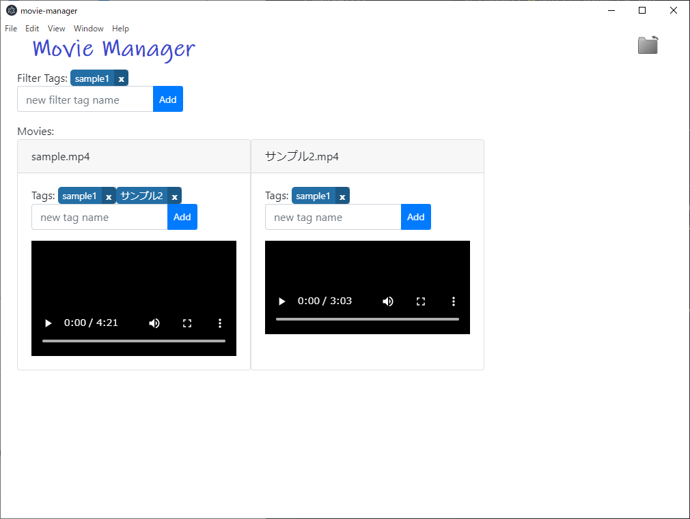

# Movie Manager

## Overview

`Movie Manager`はPC上に保存された動画ファイルを管理するためのアプリケーションです。
各動画にタグを付与でき、そのタグで見たい動画を検索することができます。

## 動作環境

64bit版 Windows

## インストール方法

- Githubからアプリをダウンロード
  - URL: [https://github.com/sh-miyoshi/movie-manager/releases/download/v0.1/movie-manager-win32-x64.zip](https://github.com/sh-miyoshi/movie-manager/releases/download/v0.1/movie-manager-win32-x64.zip)
- 任意の場所にzipを解凍
  - 展開できないものはスキップして大丈夫そうです(※)
- movie-manager.exeをダブルクリック

## 使い方

- movie-manager.exeを起動後右上のアイコンから動画ファイルのおかれたディレクトリを選択
  - 画面に動画一覧が表示されていれば成功
- 各動画にタグをつける
- タグで絞り込みたい場合はタグの名前を入力しAddボタンを押下
